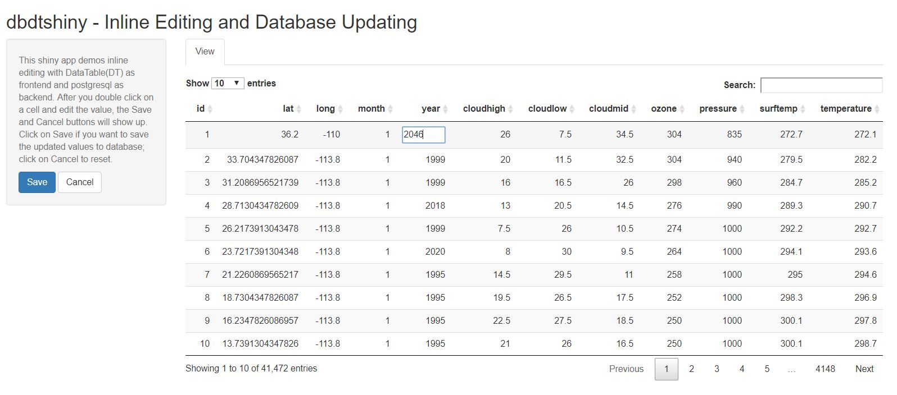

# dtdbshiny
Inline Editing and Database Updating in shiny app


There are times when it costs more than it should to leverage javascript, database, html and all that good stuff in one place. Now is time for connecting some dots, without reaching too hard. 

This shiny app aims to demonstrate minimal effort to do inline editing with DataTable at frontend and PostgreSQL at backend. After you double click on a cell and edit the value, Save and Cancel buttons will show up. Continue editing, the updates are stored in a temporary (reactiveValue) object. Click on Save if you want to send the batch updates to database; click on Cancel to reset. It doesn't rewrite the whole table in database but executes "UPDATE" queries by row/column index just in case you're wondering.

Empowered by DataTable, PostgreSQL(one of many relational database options) and the R ecosystem, the author knows javascript and sql as much as she can survive though. Workhorse functionality is made possible in the R environment by 

- DBI: R Database Interface 
- RPostgreSQL: R Interface to PostgreSQL
- pool: DBI connection object pooling
- DT: R Interface to the jQuery Plug-in DataTables
- Shiny: Web Application Framework for R
- dplyr: Data manipulation

This demo is inspired by  

- New inline edit feature of [DT](https://github.com/rstudio/DT/tree/master/inst/examples/DT-edit)(requires version >= 0.2.30)
- [dynshiny](https://github.com/MangoTheCat/dynshiny): Dynamically generated Shiny UI
- database connectivity struggles like [this](https://github.com/rstudio/pool/issues/58)
- string interpolation with SQL escaping via glue::glue_sql(). The new feature of [glue](https://github.com/tidyverse/glue)(requires version >= 1.2.0) makes construction of query handy and less cumbersome.

To run the app:

1. Set up a database instance e.g. PostgreSQL, SQLite, mySQL or MS SQL Server etc.
2. Download/clone the repository
3. Run through script `app/prep.R` but change database details to one's own. It writes to DB our demo dataset which is the *nasa* dataset from dplyr with an index column added 
4. Also update database details in `app/app.R` and run
```
shiny::runApp("app")
```


